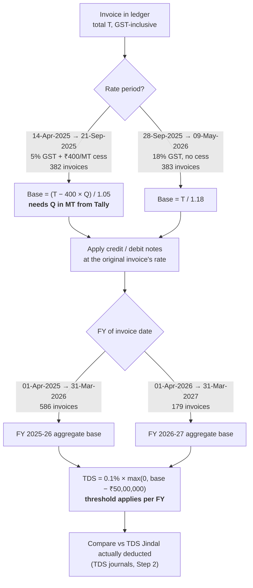

# Step 3 (proposed) — base value derivation and 194Q TDS reconciliation

Draft flow for the accountant to confirm before it is implemented. Everything
marked **CONFIRM** is a point where the accounting treatment should be signed
off rather than assumed by the code.

## 0. What this is for

Both ledgers record only the **invoice grand total** (goods + GST + cess). TDS
under section 194Q is computed on the **purchase value  excluding GST**, so the
base (taxable) value of every invoice has to be recovered before any TDS number
can be checked. The end goal is: computed 194Q TDS vs the TDS Jindal actually
deducted (already isolated in Step 2 as the TDS-flagged journal entries).

## 0a. The flow at a glance



GST rate on coal changed **22-Sep-2025** (5% → 18%, ₹400/MT compensation cess
withdrawn). No invoice in the file falls between 21-Sep-2025 and 28-Sep-2025, so
the boundary is unambiguous in this data set.

## 1. Preferred data source — do not derive if we can read

Deriving the base value from the invoice total is arithmetic guesswork that we
only need if the real number is unavailable. The far more reliable input is a
**GST sales register / item-wise voucher register exported from Delta's Tally**
(or the GSTR-1 filing data) containing, per invoice:

| Field | Why needed |
|---|---|
| Invoice (bill) no. | join key to both ledgers |
| Invoice date | rate period, FY bucketing |
| Quantity in MT | cess computation, cross-check |
| Rate per MT | cross-check |
| Taxable value | **this is the base amount — no derivation needed** |
| CGST / SGST / IGST | validates the rate applied |
| Compensation cess | validates ₹400/MT |
| Invoice total | must tie to the ledger amount already in Step 1 |

If that register is available, sections 2–3 below become a *validation* step
rather than a computation step. Derivation is the fallback for invoices the
register does not cover.

**Verified constraint:** the base value cannot be derived from the 5% invoices
without the quantity. Testing each 5% invoice total against every plausible
tonnage produces 33–40 mathematically valid (quantity, base) combinations per
invoice. Quantity is a required input, not something the code can infer.

## 2. Classifying each invoice into a rate period

The two rate regimes are already distinguishable three independent ways in the
existing data, which is a useful self-check:

| Signal | 5% period | 18% period |
|---|---|---|
| Delta voucher type | `Imported Steam Coal @ 5% GST` | `Imported Steam Coal @ 18% GST` |
| Bill number series | `GJ/25-26/…` | `GJ/18/…` and `GJ/26-27/…` |
| Invoice date range in the file | 2025-04-14 → 2025-09-21 | 2025-09-28 → 2026-05-09 |

The three signals agree on all 765 invoices in the current file, and the date
break matches the 22-Sep-2025 GST rate revision on coal (5% → 18%, with the
₹400/MT compensation cess withdrawn at the same time).

Rule: classify by **voucher type**, and raise a warning row if the bill series
or the date implies a different period. No invoice in the current file falls on
the 22-Sep-2025 boundary itself. **CONFIRM**: the effective date of the change,
and whether it is governed by invoice date or supply date.

## 3. Base amount per invoice

Let `T` = invoice total as it appears in the ledger, `Q` = quantity in MT.

**18% period (no cess):**

```
Base = T / 1.18
```

**5% period (cess applies at ₹400 per MT):**

```
Cess = 400 × Q
Base = (T − Cess) / 1.05
```

Cess is charged on the same taxable value but is a flat per-tonne amount, so it
is *added* to the invoice rather than being a percentage — hence it is
subtracted before the GST is unwound, not divided out. **CONFIRM**: that cess
was ₹400/MT flat for every consignment in the period and that no invoice
carried a different cess rate.

Checks the implementation should run per invoice:

- Recomputed total `Base + GST + Cess` must equal the ledger `T` to within ₹1.
- Derived rate per MT (`Base / Q`) must be inside a sanity band; anything
  outside is listed for manual review rather than silently used.
- Any invoice with no quantity available is listed as **unresolved**, never
  estimated.

## 4. Adjustments — credit and debit notes

Credit and debit notes change the purchase value and therefore the 194Q base.
The notes are already isolated in Step 2 (Delta: 6 credit notes, ₹27,21,237;
Jindal: 10 debit notes ₹26,19,757 and 1 credit note ₹63,24,276).

Those note amounts are also GST-inclusive and need the same base extraction,
using the rate period of the **original invoice** the note references, not the
note's own date. **CONFIRM**: whether 194Q base is taken net of credit notes
for the year, and how a note issued in a later FY against an earlier FY invoice
is treated.

## 5. Aggregation and the 194Q threshold

This is the part of the original outline that needs the most correction. TDS
under 194Q is **not** 0.1% of the whole purchase value:

1. Bucket invoices by **financial year** on invoice date. The current file spans
   1-Apr-2025 to 16-Jun-2026, i.e. two financial years — FY 2025-26 and
   FY 2026-27 — and the threshold applies **separately to each**.
2. Within an FY, aggregate the base values (net of note adjustments per §4) for
   this single seller. The threshold is per seller, per FY.
3. TDS applies only to the amount **exceeding ₹50,00,000** in that FY:

```
Taxable_for_TDS = max(0, Aggregate_base_for_FY − 50,00,000)
TDS             = 0.1% × Taxable_for_TDS
```

4. Rate is 0.1% where the seller's PAN is on record; otherwise 5%. Delta's PAN
   appears on the ledger letterhead (AAFCD5181R), so 0.1% is expected.
   **CONFIRM**.

Timing: 194Q is triggered at credit or payment, whichever is earlier. Purchases
are credited when the invoice is booked, which is earlier than payment here, so
invoice date is the correct basis. **CONFIRM**, along with whether any advance
payments preceded their invoice.

Also **CONFIRM**: that 194Q (buyer deducts TDS) applies rather than 206C(1H)
(seller collects TCS) — the two are mutually exclusive, and 194Q takes
precedence where the buyer's previous-year turnover exceeds ₹10 crore.

## 6. Reconciliation output

For each FY, present:

- aggregate base, split by rate period, with invoice counts
- total GST and total cess derived, as a cross-check against the GST returns
- note adjustments applied
- threshold applied, taxable amount, computed TDS
- TDS actually deducted by Jindal, from the TDS-flagged journal entries in
  Step 2
- the difference, and the invoices that could not be resolved for want of
  quantity data

Rounding: base and tax to 2 decimals per invoice; TDS rounded to the nearest
rupee at the FY level, not per invoice.

## 7. Open questions for the accountant

1. Can Tally give the taxable value directly (§1)? That removes all derivation.
2. Effective date and governing date basis for the 22-Sep-2025 rate change (§2).
3. Cess flat ₹400/MT for the whole 5% period, no exceptions (§3).
4. Treatment of credit/debit notes in the 194Q base, including cross-FY notes (§4).
5. Threshold applied per FY per seller, and the ₹50 lakh already correct for
   both years in scope (§5).
6. Whether TDS was deducted on invoice credit or on payment (§5).
7. Whether any purchases sit outside this ledger and should count toward the
   same ₹50 lakh threshold (§5).
